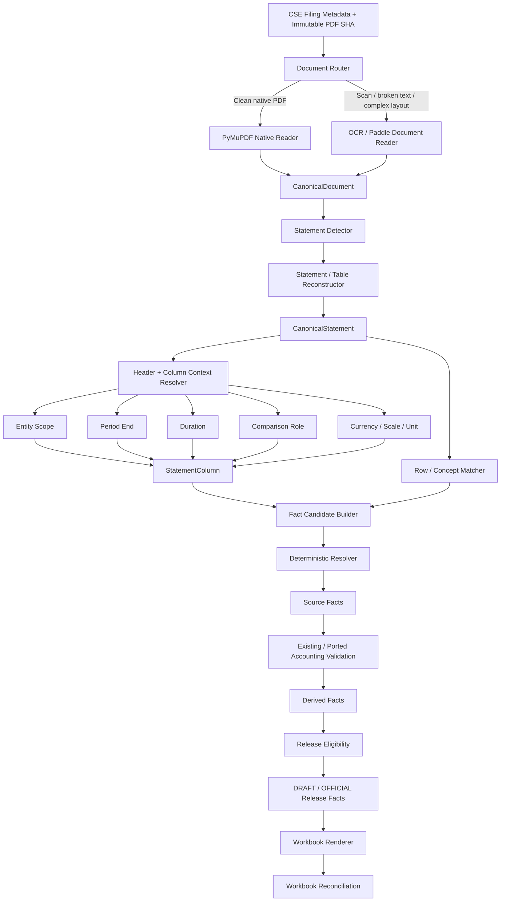

# CSE Financial Data Platform V2
## Cursor / AGI Implementation Plan — Final Build Specification

**Project:** CSE Financial Data Platform  
**Repository:** `Thanuka9/CSE-Report`  
**V1 reference commit:** `ae2a721a332de252c841693b301b52692f8863d8`  
**Date of V2 decision:** 2026-09-13  
**Primary goal:** Build the final production V2 extraction/context engine while preserving V1 components that are already proven and useful.

---

# 0. How the Coding Agent Must Use This Document

This document is the **authoritative implementation plan for V2**.

The coding agent must:

1. Read this file before changing code.
2. Inspect the current repository before implementing each phase.
3. Follow the phase order unless a dependency makes that impossible.
4. Preserve working V1 acquisition, source-versioning, evidence storage, accounting validation, derived-metric logic, and release concepts unless this document explicitly says otherwise.
5. Build V2 in an isolated namespace first.
6. Never silently reinterpret a source fact to satisfy an output requirement.
7. Never lower a coverage baseline to make a failing run pass.
8. Never treat `2,394` publishable facts as an acceptable replacement for the historical `~8,924` reference.
9. Prefer deterministic logic and explicit source evidence over heuristic guessing.
10. Add tests with every implementation change.
11. Do not introduce BGE, LightGBM, CP-SAT, PostgreSQL, or another large infrastructure dependency unless a later evidence gate in this plan explicitly justifies it.
12. Do not delete V1 extraction code until V2 has passed the defined cutover gates.
13. Do not redesign architecture while implementing. If a new requirement conflicts with this plan, record it in a decision log and stop only the affected component, not the entire project.
14. Keep changes small enough to test and review.
15. Treat the V1 corpus and failures as training/evaluation evidence, not as code that must be copied.

The agent's job is **execution**, not reinvention.

---

# 1. Decision Record

On 2026-09-13 we decided to build a new V2 financial document extraction and context-resolution core while retaining V1's proven outer platform.

This decision was based on three independently confirmed incidents:

1. A reproducible coverage collapse from approximately **8,924 DRAFT-publishable facts to 2,394 facts**, a loss of about **73%**.
2. The regression baseline was later lowered from approximately `8,924` to `2,394`, allowing a severe recall collapse to appear acceptable.
3. A release-mode bug caused a generated workbook to contain status strings instead of expected numeric DRAFT values because publication behavior depended on process-global state.

The controlled fixed-input replay of current code against the exact September 10 historical input snapshot **had not yet been executed at the time the rebuild decision was made**.

Therefore:

> The V2 rebuild is a deliberate risk-based engineering decision under deadline pressure. It is not a claim that the controlled replay proved the repaired V1 core remained broken.

The fixed-input replay is still required, but it runs **in parallel** and is used to prioritize V2 work rather than gate the start of V2.

---

# 2. Core Production Principle

The most important rule in V2 is:

> **Information may become more specific downstream, but it may never be silently invented, overwritten, reinterpreted, or stripped of its source ownership.**

If the source column is:

```text
GROUP / 6 months / prior year / Rs '000
```

no downstream layer may transform it into:

```text
COMPANY / 3 months / current year / Rs
```

because that is what the output needs.

The system must locate the correct source evidence or return a typed missing/unresolved result.

---

# 3. Coverage Principle

Fail-closed behavior and acceptable coverage are separate concepts.

A system may correctly refuse uncertain values and still be unusable if it rejects facts that are clearly present in source filings.

Historical reference:

```text
DRAFT publishable facts ≈ 8,924
```

Collapsed run:

```text
DRAFT publishable facts = 2,394
Retention ≈ 26.8%
Loss ≈ 73.2%
```

`2,394` is **not acceptable production coverage**.

It is evidence of a severe regression unless proven that the historical facts were themselves invalid.

Normal implementation changes must not redefine this failure as success.

---

# 4. KEEP vs REBUILD

## 4.1 KEEP from V1

Keep or reuse the following unless a concrete defect is discovered during implementation:

```text
CSE universe discovery
CSE filing metadata acquisition
immutable PDF storage
content-addressed SHA-256 filing versions
filing revision history
raw-source archive
Parquet / JSONL evidence storage
Decimal-based financial normalization
source-fact vs derived-fact distinction
accounting-equation validation concepts
derived metric formulas
review/adjudication evidence
DRAFT / OFFICIAL release concept
immutable staging generation concept
per-metric coverage monitoring
sector × metric monitoring
existing regression PDFs
existing manual verification evidence
market-data source concepts
```

The agent may refactor adapters around these components, but must not rebuild them merely for stylistic consistency.

---

## 4.2 REBUILD for V2

The new core must replace or supersede:

```text
dual document IR ownership
cross-IR context bridges
monolithic statement extraction
post-hoc entity inference
post-hoc period inference
post-hoc unit inference
duplicated metric semantic definitions
layout context that can be lost between modules
runtime extraction monkey patches
hardening code that changes extraction meaning after the fact
```

The V2 extraction path is built cleanly around:

```text
CanonicalDocument
CanonicalStatement
StatementColumn
StatementCell
ConceptRegistry
FactCandidate
SourceFact
```

---

# 5. Target V2 Architecture



---

# 6. Repository Strategy

Do not overwrite V1 in place while V2 is being built.

Create:

```text
src/cse_financial_etl/v2/
```

Recommended structure:

```text
src/cse_financial_etl/v2/
├── __init__.py
│
├── contracts/
│   ├── __init__.py
│   ├── enums.py
│   ├── provenance.py
│   ├── document.py
│   ├── statement.py
│   ├── concepts.py
│   ├── facts.py
│   ├── release.py
│   └── diagnostics.py
│
├── document/
│   ├── __init__.py
│   ├── router.py
│   ├── native_reader.py
│   ├── ocr_reader.py
│   ├── quality.py
│   └── canonicalize.py
│
├── statements/
│   ├── __init__.py
│   ├── detector.py
│   ├── table_reconstructor.py
│   ├── header_tree.py
│   ├── column_context.py
│   └── statement_builder.py
│
├── taxonomy/
│   ├── __init__.py
│   ├── registry.py
│   ├── matcher.py
│   └── profiles.py
│
├── resolution/
│   ├── __init__.py
│   ├── entity.py
│   ├── period.py
│   ├── units.py
│   ├── candidate_builder.py
│   └── resolver.py
│
├── validation/
│   ├── __init__.py
│   ├── structural.py
│   ├── accounting.py
│   ├── cross_period.py
│   └── publication.py
│
├── orchestration/
│   ├── __init__.py
│   ├── filing_pipeline.py
│   ├── universe_pipeline.py
│   └── run_manifest.py
│
├── reporting/
│   ├── __init__.py
│   ├── release_view.py
│   ├── workbook.py
│   └── reconciliation.py
│
└── diagnostics/
    ├── __init__.py
    ├── stage_metrics.py
    ├── fact_diff.py
    └── replay.py
```

Tests:

```text
tests/v2/
├── unit/
├── property/
├── fixtures/
├── regression/
├── golden/
└── universe/
```

Do not delete existing V1 packages during development.

---

# 7. Core Data Contracts

All V2 cross-module data must use explicit typed contracts.

Use Pydantic 2 models or frozen dataclasses where appropriate.

## 7.1 Provenance

Every evidence-bearing object must be source-bound.

Minimum provenance:

```python
class SourceRef(BaseModel):
    filing_id: str
    filing_version_id: str
    source_sha256: str
    page_number: int
    bbox: tuple[float, float, float, float] | None
    raw_text: str | None
    parser_name: str
    parser_version: str
```

Never emit a source fact without a source reference.

---

## 7.2 CanonicalDocument

```python
class CanonicalToken(BaseModel):
    text: str
    page_number: int
    bbox: tuple[float, float, float, float]
    confidence: float | None = None
    source_parser: str

class CanonicalLine(BaseModel):
    line_id: str
    tokens: tuple[CanonicalToken, ...]
    bbox: tuple[float, float, float, float]

class CanonicalPage(BaseModel):
    page_number: int
    width: float
    height: float
    lines: tuple[CanonicalLine, ...]
    extraction_mode: Literal["NATIVE", "OCR", "HYBRID"]

class CanonicalDocument(BaseModel):
    filing_version_id: str
    source_sha256: str
    pages: tuple[CanonicalPage, ...]
    parser_manifest: dict[str, str]
```

The exact schema may evolve, but there must be exactly **one canonical document representation** used by V2 downstream modules.

---

## 7.3 CanonicalStatement

```python
class CanonicalStatement(BaseModel):
    statement_id: str
    filing_version_id: str
    statement_type: StatementType
    pages: tuple[int, ...]
    rows: tuple["StatementRow", ...]
    columns: tuple["StatementColumn", ...]
    source_refs: tuple[SourceRef, ...]
```

Statement types:

```text
INCOME_STATEMENT
BALANCE_SHEET
CASH_FLOW
CHANGES_IN_EQUITY
EPS_NOTE
OTHER_FINANCIAL_STATEMENT
```

---

## 7.4 StatementColumn — critical object

Context belongs to the column before metric extraction.

```python
class StatementColumn(BaseModel):
    column_id: str

    entity_scope: EntityScope | None
    entity_evidence: tuple[SourceRef, ...]

    period_end: date | None
    period_evidence: tuple[SourceRef, ...]

    duration_months: int | None
    duration_evidence: tuple[SourceRef, ...]

    comparison_role: ComparisonRole | None
    comparison_evidence: tuple[SourceRef, ...]

    currency: str | None
    monetary_scale: Decimal | None
    unit_dimension: UnitDimension | None
    unit_evidence: tuple[SourceRef, ...]

    confidence: float | None
```

Important:

`confidence` is diagnostic only.

Confidence never replaces evidence.

---

## 7.5 StatementCell

```python
class StatementCell(BaseModel):
    cell_id: str
    row_id: str
    column_id: str
    raw_text: str
    parsed_numeric_value: Decimal | None
    source_ref: SourceRef
```

---

# 8. Context Resolution Rules

## 8.1 Entity

Store separately:

```text
expected_entity_scope
source_entity_scope
```

Expected entity comes from issuer/master policy.

Source entity must come from filing evidence.

Allowed examples:

```text
COMPANY
BANK
GROUP
CONSOLIDATED
SEPARATE
UNKNOWN
```

Rules:

- Never convert `GROUP` to `COMPANY`.
- Never convert `CONSOLIDATED` to `COMPANY`.
- If required standalone scope is not proven, withhold.
- Name matching is not source evidence.
- Filing request metadata is not sufficient source evidence by itself.

---

## 8.2 Period

Every financial column should attempt to resolve:

```text
period_end
duration_months
comparison_role
```

Recognize formats including:

```text
30-Jun-26
30 June 2026
30/06/2026
2026-06-30
03 months
3 months
three months
quarter ended
six months
nine months
year ended
```

Current/comparative role must come from statement/header structure.

Do not infer a source period solely because the pipeline requested that quarter.

---

## 8.3 Exact Quarter Rule

For quarterly flow metrics:

```text
duration_months == 3
comparison_role == CURRENT
period_end == target_period_end
```

Required.

Flow metrics include at least:

```text
PAT
PBT
OPERATING_PROFIT
TOP_LINE
EPS_BASIC
EPS_DILUTED
```

---

## 8.4 Q4 Rule

Q4 must be explicitly reported as a 3-month source value.

Forbidden:

```text
FY - 9M
```

Do not manufacture Q4.

Do not populate quarter values with:

```text
6M
9M
12M
FY
YTD
```

---

## 8.5 Units

Unit declarations are evidence objects.

Scopes may include:

```text
REPORT
STATEMENT
TABLE
COLUMN
ROW
CELL
```

Resolution rule:

> Use the closest compatible explicit source declaration.

Examples:

```text
Rs.
LKR
Rs '000
LKR thousands
Rs million
LKR million
cents per share
percentage
number of shares
```

Unit dimensions must distinguish:

```text
MONETARY
PER_SHARE
PERCENTAGE
RATIO
COUNT
```

Per-share/percentage/count facts must not inherit ordinary monetary scaling.

Unit conflict => withhold.

---

# 9. Concept Registry

V2 must have **one authoritative concept registry**.

Do not distribute semantic truth across:

```text
regexes
metric_catalog.yml
hard-coded Python lists
semantic matcher aliases
production hardening overrides
```

Target registry fields:

```yaml
code:
display_name:
metric_type:
statement_types:
period_behavior:
unit_dimension:
allowed_entity_profiles:
accounting_regimes:
exact_aliases:
synonyms:
forbidden_aliases:
source_only:
derivation_allowed:
```

Initial core concepts:

```text
PAT
PBT
EPS_BASIC
EPS_DILUTED
NAVPS
OPERATING_PROFIT
TOTAL_EQUITY
TOTAL_ASSETS
TOTAL_LIABILITIES
TOP_LINE
```

Derived concepts:

```text
EPS_SELECTED
LIABILITIES_TO_EQUITY
ROE
ROA
NPM
```

Market concept:

```text
LAST_TRADED_PRICE
```

---

# 10. Sector / Accounting Profiles

Shared architecture, controlled profiles.

Profiles:

```text
GENERAL
BANK
FINANCE_COMPANY
INSURANCE
```

Profiles may define:

```text
expected statements
allowed concept aliases
expected standalone scope
regime-specific top-line semantics
accounting validation rules
```

Do not create entirely separate extraction engines per sector.

Insurance must preserve source-regime meaning.

Examples:

```text
SLFRS4:
Gross written premium / Net earned premium

SLFRS17:
Insurance revenue
```

Do not silently treat them as identical source concepts.

---

# 11. Metric Matching

Phase 1 matcher should be deterministic.

Priority:

```text
1. exact normalized alias
2. strong controlled alias
3. RapidFuzz candidate generation
4. structural/context compatibility
5. abstain
```

RapidFuzz may generate candidates.

It may not decide publication truth alone.

Do not introduce embedding models in the initial V2 build.

Design a future interface such as:

```python
class ConceptCandidateProvider(Protocol):
    def candidates(self, row: StatementRow) -> list[ConceptCandidate]: ...
```

so embeddings can later be plugged in without changing downstream contracts.

---

# 12. Resolver

Initial V2 resolver remains deterministic.

It may choose among fully contextualized candidates.

It may not invent missing context.

Resolver inputs must already contain:

```text
source cell
row concept candidate
entity context
period context
duration
comparison role
unit context
source provenance
```

Forbidden behavior:

```text
entity missing → assume COMPANY
period missing → assume requested quarter
unit missing → assume Rs '000
current/prior missing → assume CURRENT
```

If required evidence is absent:

```text
WITHHOLD
```

---

# 13. Source Facts

A `SourceFact` must retain the complete source identity.

Suggested contract:

```python
class SourceFact(BaseModel):
    fact_id: str
    filing_version_id: str
    statement_id: str
    cell_id: str

    issuer_id: str
    metric_code: str

    entity_scope: EntityScope
    period_end: date
    duration_months: int | None
    comparison_role: ComparisonRole

    raw_value: Decimal
    normalized_value: Decimal

    currency: str | None
    source_scale: Decimal | None
    unit_dimension: UnitDimension

    source_ref: SourceRef

    validation_status: ValidationStatus
    review_status: ReviewStatus
    reason_codes: tuple[str, ...]
```

No publication-specific mutation should alter the source fact.

---

# 14. Derived Facts

Derived facts must never masquerade as source facts.

Examples:

```text
EPS_SELECTED
Liabilities / Equity
ROE
ROA
NPM
```

Formulas:

```text
EPS_SELECTED =
    EPS_DILUTED if valid reported diluted exists
    else EPS_BASIC if valid reported basic exists
    else missing
```

```text
Liabilities / Equity =
    TOTAL_LIABILITIES / TOTAL_EQUITY
```

```text
ROE =
    PAT / denominator defined by governed methodology
```

```text
ROA =
    PAT / denominator defined by governed methodology
```

```text
NPM =
    PAT / TOP_LINE
```

The exact denominator methodology must come from the governed metric definition and must not be silently changed by implementation code.

---

# 15. Total Liabilities Rule

`TOTAL_LIABILITIES` must be explicit source evidence.

Forbidden publication derivation:

```text
TOTAL_ASSETS - TOTAL_EQUITY
```

That equation is only a validation/reconciliation signal.

---

# 16. Market Price

Market data remains a separate domain.

Required semantic:

```text
LAST_TRADED
```

Quarter-end selection:

```text
exact security
last valid trade on or before quarter end
```

Forbidden substitutions unless explicit governed policy allows them:

```text
current live price
generic "price"
unrelated closing value
different security class
future-dated price
```

---

# 17. Status Model

Do not use one primary status to hide secondary failures.

At minimum record independent dimensions:

```text
document_status
statement_status
concept_status
entity_status
period_status
duration_status
comparison_status
unit_status
validation_status
review_status
publication_status
reason_codes[]
```

Example:

```text
concept_status = RESOLVED
entity_status = UNRESOLVED
period_status = RESOLVED
unit_status = RESOLVED
publication_status = WITHHELD
```

This is critical for diagnostics.

---

# 18. Release Context — mandatory Day-One fix

Release behavior may not depend on mutable process-global state.

Use:

```python
class ReleaseContext(BaseModel):
    generation_id: str
    run_id: str
    mode: Literal["DRAFT", "OFFICIAL"]
    code_sha: str
    policy_hash: str
    source_snapshot_id: str
```

Pass it explicitly.

Do not use:

```python
set_release_mode(...)
```

as authoritative V2 design.

Compatibility adapters may temporarily call old V1 APIs, but V2 itself must remain explicit.

---

# 19. Coverage Governance — mandatory Day-One fix

Normal implementation changes may:

```text
keep coverage floors unchanged
raise coverage floors
```

They may **not lower floors**.

Lowering requires a separate governed change.

Required metadata:

```text
old value
new value
affected metric(s)
affected sector(s)
reason
incident ID
source snapshot ID
reference run ID
new run ID
code SHA
evidence
ACKNOWLEDGED_REGRESSION
approver
```

CI must reject unauthorized floor reductions.

The baseline file must not be silently recalibrated to a failing result.

---

# 20. Workbook Reconciliation — mandatory Day-One fix

Excel is a renderer, not a publication engine.

Workbook financial cells must contain:

```text
numeric value
or blank/null
```

Never:

```text
ENTITY_NOT_RESOLVED
REVIEW_REQUIRED
PERIOD_NOT_RESOLVED
```

Status/reason information belongs on dedicated sheets.

Required reconciliation:

```text
eligible release facts
→ facts selected for pivot
→ expected displayed fact instances
→ actual numeric workbook cells
```

Every exclusion or duplication must be explicit and accounted for.

Unexpected mismatch:

```text
WORKBOOK_RECONCILIATION_FAILED
```

The workbook must not be released.

---

# 21. Workbook Sheets

Recommended final structure:

```text
Snapshot
Financial_Facts
Quarter_End_Prices
Missing_Values
Review_Summary
Data_Quality
Run_Manifest
Issuer_Master
Metric_Definitions
Source_Lineage
```

The Snapshot must remain analysis-friendly.

---

# 22. Required Output Metrics

Per requested quarter:

1. PAT
2. PBT
3. EPS Selected
4. NAVPS
5. Operating Profit
6. Total Equity
7. Total Assets
8. Total Liabilities
9. Top Line
10. Last Traded Price at quarter end
11. Liabilities / Equity
12. ROE
13. ROA
14. NPM

---

# 23. Document Routing

Do not run expensive OCR on every PDF.

Compute page/document quality features:

```text
embedded text availability
native token count
numeric density
image coverage
coordinate consistency
font/text corruption
table alignment
scan likelihood
```

Route:

```text
clean native
→ PyMuPDF

native but structurally complex
→ PyMuPDF + table/layout analysis

broken native text
→ OCR/document vision

scan
→ OCR/document vision

mixed PDF
→ page-level hybrid route
```

---

# 24. OCR / Paddle Integration

Paddle/OCR is an **additional evidence source**, not a direct fact generator.

It should output into the same:

```text
CanonicalDocument
```

contract.

Do not create:

```text
OCRDocumentIR
```

as a separate downstream world.

The parser may differ.

The downstream model must not.

---

# 25. Table Transformer

Table Transformer is optional, targeted, and must not block initial V2.

Use only if difficult financial tables remain a recurring source of structural errors.

Possible role:

```text
independent table structure verifier
```

Do not introduce it to every page by default.

---

# 26. Deferred Technologies

Do not make the first production V2 depend on:

```text
BGE embeddings
LightGBM LambdaRank
CP-SAT global solver
isotonic calibration
Platt calibration
PostgreSQL
large MLOps platform
general-purpose LLM fact extraction
```

These are extension options, not launch requirements.

Introduce them only when measured failure classes justify them.

---

# 27. LLM Policy

General LLMs may help with:

```text
developer investigation
test generation
alias proposals
failure explanation
annotation assistance
```

They may not directly author authoritative financial values.

Never store:

```text
"LLM says PAT = ..."
```

as source truth.

---

# 28. Parallel Fixed-Input Replay

The replay runs while V2 is being built.

It does not block V2 start.

## 28.1 Runs

| Run | Code | Input | Purpose |
|---|---|---|---|
| Reference | historical accepted code | frozen Sept-10 source snapshot | historical reference |
| Replay A | current main | same Sept-10 snapshot | code-only comparison |
| Replay B | current main | same Sept-10 snapshot | determinism |
| Current A | current main | newly frozen current snapshot | current production behavior |
| Current B | current main | same current snapshot | determinism |

---

## 28.2 Pin runtime metadata

Capture:

```text
code SHA
source snapshot ID
every PDF SHA
market-data snapshot
configuration hash
policy hash
concept registry hash
uv.lock hash
Python version
OS/container identity
PyMuPDF version
pdfplumber version
OCR version
Tesseract version
environment variables affecting extraction
```

---

## 28.3 Fact identity comparison

Do not compare only counts.

Historical-vs-current diff key should include at least:

```text
filing_version_id
entity_scope
period_end
duration_months
comparison_role
metric_code
```

and statement/source identity when needed.

Classify:

```text
UNCHANGED
LOST
NEW
VALUE_CHANGED
CONTEXT_CHANGED
STATUS_CHANGED
```

---

## 28.4 Determinism

Replay A and Replay B must match for:

```text
fact identity
normalized values
statuses
reason codes
stage counts
material manifest metadata
```

If they differ:

```text
STOP DIAGNOSTIC ATTRIBUTION
```

Find nondeterminism first.

---

# 29. Independent Context Rates

Report these against the same candidate population independently:

```text
entity resolution rate
period resolution rate
duration resolution rate
comparison-role resolution rate
unit resolution rate
concept resolution rate
```

Also report intersections:

```text
entity + period
entity + unit
period + unit
entity + period + unit
all required context
```

Do not instrument entity → period → unit as if they are strictly sequential dependencies.

---

# 30. Replay Decision Thresholds

Pre-register before looking at the result.

## STOP — nondeterministic

If fixed-code + fixed-input repeated runs differ materially:

```text
STOP
```

Do not classify A/B/C.

---

## A — approximately full recovery

Requirements:

```text
overall baseline identity retention >= 98%
every top-level metric retention >= 97%
every sector × metric slice retention >= 95%
retained normalized value agreement >= 99.5%
no unexplained systematic context/value shift
```

If A:

```text
reuse more V1 extraction logic
focus V2 on architecture cleanup and prevention
```

---

## B — structural failure

Any of:

```text
overall retention < 90%
any top-level metric < 85%
any sector × metric slice < 70%
broad entity/period/unit failure affects >= 10% of baseline facts
```

If B:

```text
deep rebuild of responsible extraction/context components
```

`2,394 / 8,924` is automatic B.

---

## C — concentrated failure

Anything deterministic between A and B, especially where loss is localized by:

```text
sector
metric
parser path
layout family
entity mode
OCR/native
```

If C:

```text
selectively replace the failing subsystem
```

---

# 31. Stage-Level Diagnostics

Every run should expose:

```text
filings available
documents parsed
statements detected
source numeric cells
concept candidates
entity-resolved candidates
period-resolved candidates
duration-resolved candidates
comparison-resolved candidates
unit-resolved candidates
source facts
validated facts
DRAFT-eligible facts
pivot facts
numeric workbook cells
```

Breakdowns:

```text
issuer
sector
metric
period
statement
parser
native/OCR
reason code
```

---

# 32. Golden Corpus

Initial engineering golden corpus:

```text
25–40 deeply adjudicated filings
```

Do not optimize for random issuer count.

Optimize for failure diversity.

Must include:

```text
general corporates
banks
finance companies
insurance companies
holding companies
Main Board
Empower
native PDFs
scanned PDFs
complex tables
multi-page statements
Group + Company
comparative columns
non-calendar year-end
Rs
Rs '000
Rs million
3M + 6M
3M + 9M
reported Q4
date-format variants
known V1 entity failures
known V1 period failures
known V1 unit failures
known timeout/pathological PDFs
```

Each manually checked target fact should store:

```text
metric
raw source value
normalized value
entity
period
duration
comparison role
unit
page
bbox
PDF SHA
reviewer
review date
```

Grow toward the institutional 100-issuer requirement before OFFICIAL production certification.

---

# 33. Known Regression Cases to Preserve

At minimum create regression fixtures for:

```text
Abans Electricals
Citizens Development Business Finance
Softlogic-related unit/header cases
30-Jun-26 date format
03 MONTHS / zero-padded durations
numeric duration headings
Group vs Company ambiguity
cumulative vs exact-quarter ambiguity
the three known timeout filings
DRAFT fresh-process workbook bug
coverage-baseline lowering incident
```

Every known V1 bug becomes a permanent test.

---

# 34. Test Strategy

## Unit tests

Every parser/context rule.

Examples:

```text
date parsing
duration parsing
negative numbers
bracket values
scale parsing
entity headings
comparison-role headings
row aliases
concept exclusions
```

---

## Property tests

Use Hypothesis for invariants such as:

```text
normalization is idempotent
scale application preserves Decimal exactness
source fact cannot exist without provenance
flow publication cannot accept duration != 3
Q4 derived value cannot become source fact
GROUP cannot silently become COMPANY
future market price cannot be selected
```

---

## Regression tests

Known real PDFs and real failure snippets.

---

## Golden tests

Manually adjudicated facts.

---

## Universe tests

Coverage/stability across the entire frozen universe.

---

# 35. CI Layers

## Commit CI

```text
ruff
mypy
unit tests
property tests
synthetic fixtures
baseline-governance check
```

## PR CI

```text
commit CI
representative real PDFs
all known regression cases
workbook reconciliation test
```

## Release Candidate

```text
golden corpus
fixed historical replay
current frozen universe
```

## OFFICIAL

```text
engineering gates
required human proof
release approvals
immutable release manifest
```

---

# 36. Implementation Sequence

The agent must follow this order.

---

## Phase 0 — Freeze and Isolate

Deliverables:

```text
V1 reference tag/record
V2 decision record
src/cse_financial_etl/v2/
tests/v2/
parallel replay script skeleton
```

Do not alter production behavior yet.

Acceptance:

```text
existing V1 CI still passes
new V2 package imports cleanly
```

---

## Phase 1 — Governance Guards First

Implement:

```text
coverage-floor non-lowering CI check
explicit V2 ReleaseContext contract
workbook reconciliation test harness
```

Why first:

These address proven incidents and protect all later work.

Acceptance:

```text
test proves normal PR cannot lower baseline
test proves explicit release context required
test proves workbook mismatch fails
```

---

## Phase 2 — Core Contracts

Implement:

```text
SourceRef
CanonicalToken
CanonicalLine
CanonicalPage
CanonicalDocument
CanonicalStatement
StatementRow
StatementColumn
StatementCell
FactCandidate
SourceFact
DerivedFact
diagnostic status enums
```

No extraction logic yet.

Acceptance:

```text
strict typing
serialization tests
immutability where appropriate
schema/version field present
```

---

## Phase 3 — Native Document Reader

Implement:

```text
PyMuPDF → CanonicalDocument
```

Preserve:

```text
text
bbox
page
line grouping
source parser metadata
```

Do not map financial concepts yet.

Acceptance:

```text
clean native fixtures produce stable CanonicalDocument
repeat parsing is deterministic
```

---

## Phase 4 — Statement Detection

Implement deterministic statement-page/region detection.

Initial classes:

```text
INCOME_STATEMENT
BALANCE_SHEET
CASH_FLOW
CHANGES_IN_EQUITY
EPS_NOTE
OTHER
```

Acceptance:

```text
golden fixture statement pages detected correctly
false positives from notes constrained
```

---

## Phase 5 — Statement Reconstruction

Build:

```text
rows
columns
header hierarchy
cells
```

This phase must not assign financial metrics yet.

Acceptance:

```text
table/statement structure visually corresponds to source
cell → page/bbox lineage preserved
```

---

## Phase 6 — Column-Owned Context

Highest-priority semantic phase.

Implement independently:

```text
entity resolver
period resolver
duration resolver
comparison-role resolver
unit resolver
```

Bind outputs to `StatementColumn`.

Acceptance:

```text
column has explicit source evidence for each resolved dimension
no query-target metadata masquerades as source evidence
independent context resolution metrics emitted
```

---

## Phase 7 — Concept Registry

Create one V2 authoritative registry.

Migrate only verified semantics.

Resolve conflicts before adding aliases.

Acceptance:

```text
single registry loader
schema validation
duplicate alias/conflict detection
regime-aware concepts
```

---

## Phase 8 — Row Concept Matching

Implement:

```text
exact aliases
controlled normalized aliases
RapidFuzz candidate generation
statement/profile compatibility
```

No embeddings initially.

Acceptance:

```text
golden row labels generate correct candidate sets
ambiguous rows remain ambiguous
```

---

## Phase 9 — Candidate Builder and Resolver

Combine:

```text
row concept candidates
+
column context
+
source cell
```

into `FactCandidate`.

Resolver chooses only supported candidates.

Acceptance:

```text
no missing entity/period/unit can be filled by assumption
all emitted SourceFacts have lineage
```

---

## Phase 10 — Existing Validation Integration

Connect V2 SourceFacts into the proven validation/derived layer through a compatibility boundary.

Do not duplicate accounting logic unless required.

Acceptance:

```text
same equation behavior for equivalent facts
source/derived separation maintained
Q4 rule enforced
explicit liabilities rule enforced
```

---

## Phase 11 — OCR / Complex PDF Route

Only now add OCR/document-vision route.

Output must normalize to the existing `CanonicalDocument`.

Initial priority:

```text
scanned PDFs
broken embedded text
known complex layout failures
```

Acceptance:

```text
OCR path passes same downstream tests as native path
no OCR-specific semantic shortcuts
```

---

## Phase 12 — Workbook V2 Renderer

Renderer consumes release-ready data only.

Implement:

```text
numeric-or-null financial cells
separate missing/review sheets
explicit release context
full reconciliation
```

Acceptance:

```text
eligible facts reconcile to displayed numeric cells
known zero-value workbook regression impossible
```

---

## Phase 13 — Golden Corpus Run

Run all 25–40 deep fixtures.

Report:

```text
precision
source-reported recall
entity accuracy
period accuracy
duration accuracy
unit accuracy
numeric accuracy
```

Do not use aggregate coverage alone.

---

## Phase 14 — Full Universe Shadow Run

Run V1 and V2 on same frozen universe.

Diff by fact identity.

Report:

```text
retained
lost
new
value changed
context changed
status changed
```

Break down by:

```text
metric
sector
issuer
parser path
reason code
```

---

## Phase 15 — Cutover

Only after acceptance.

Cutover strategy:

1. Make V2 extraction the default.
2. Keep V1 extraction accessible only for replay/challenger mode temporarily.
3. Run another full frozen-universe acceptance.
4. Run current snapshot.
5. Generate DRAFT output.
6. Complete required human checks.
7. Remove obsolete V1 extraction paths only after rollback window closes.

---

# 37. Acceptance Targets

Initial engineering targets:

```text
critical wrong populated facts in gold corpus = 0
entity accuracy >= 99.8%
period/duration accuracy >= 99.8%
unit accuracy >= 99.8%
numeric accuracy >= 99.5%
source-reported target-fact recall >= 97%
unresolved published entity = 0
unresolved published period = 0
unresolved published monetary unit = 0
cumulative value published as quarter = 0
derived Q4 published as reported Q4 = 0
future market-price leakage = 0
workbook reconciliation violations = 0
```

Coverage relative to historical fixed snapshot must satisfy the pre-registered A/B/C rules.

---

# 38. What the Agent Must Never Do

Forbidden:

```text
lower baseline because current output is lower
copy requested quarter into unresolved source period
copy expected COMPANY into unresolved source entity
assume monetary unit
use FY - 9M as reported Q4
use Assets - Equity as published Total Liabilities
silently substitute Group for Company
silently use Group because Company is absent
write status strings into numeric workbook fields
change DRAFT/OFFICIAL behavior from process-global defaults
swallow extraction exceptions without typed diagnostics
select parser solely because it emitted more tokens
create issuer-specific numeric hard fixes
patch generated output rather than fixing source interpretation
allow confidence score to override missing source evidence
use live market price as historical quarter-end price
```

---

# 39. Coding Standards

The current project already uses:

```text
Python >=3.12
Pydantic 2
Polars
PyArrow
PyMuPDF
pdfplumber
RapidFuzz
openpyxl
pytest
Hypothesis
Ruff
mypy strict
uv
```

V2 should remain compatible with the existing toolchain unless a dependency is explicitly approved.

Rules:

```text
strict typing
no Any at module boundaries unless unavoidable
Decimal for financial arithmetic
no float for authoritative monetary calculations
pure functions where practical
small modules
typed exceptions
structured diagnostics
deterministic ordering
explicit schemas
no hidden mutable global state
```

---

# 40. Agent Commit Strategy

Prefer one coherent commit per completed phase/subphase.

Example:

```text
v2: add canonical document contracts
v2: implement native PyMuPDF reader
v2: add statement detection
v2: implement column period context
v2: implement entity scope ownership
v2: add concept registry
v2: add source fact resolver
```

Do not mix:

```text
architecture changes
baseline changes
large test-fixture updates
unrelated cleanup
```

in one commit.

A coverage baseline reduction must never share a commit with an implementation change.

---

# 41. Decision Log

Create:

```text
docs/v2/DECISIONS.md
```

Each nontrivial deviation from this plan must record:

```text
date
decision
reason
alternatives
evidence
affected modules
whether temporary/permanent
```

No silent architecture drift.

---

# 42. V2 Documentation Files

Create:

```text
docs/v2/
├── AGENT_IMPLEMENTATION_PLAN.md
├── DECISIONS.md
├── DATA_CONTRACT.md
├── CONCEPT_REGISTRY.md
├── RELEASE_CONTRACT.md
├── REPLAY_PROTOCOL.md
└── CUTOVER_CHECKLIST.md
```

This file becomes:

```text
docs/v2/AGENT_IMPLEMENTATION_PLAN.md
```

---

# 43. Progress Tracking

Create a checklist:

```text
docs/v2/IMPLEMENTATION_STATUS.md
```

Format:

```markdown
## Phase 6 — Column-Owned Context
- [x] Entity model
- [x] Period model
- [ ] Duration parser
- [ ] Unit evidence hierarchy

Evidence:
- tests: ...
- fixtures: ...
- commit: ...
- remaining risks: ...
```

Do not mark a phase complete because code exists.

Mark complete only when acceptance tests pass.

---

# 44. Definition of Done for V2

V2 is complete only when:

```text
1. one canonical document representation is used by the V2 core
2. source context is owned structurally rather than reconstructed after metric matching
3. all required source facts retain exact provenance
4. quarter-flow semantics are enforced
5. Q4 is reported-only
6. Total Liabilities is explicit-source-only
7. entity/period/unit unresolved facts cannot publish
8. source and derived facts remain distinct
9. release mode is explicit
10. coverage floors cannot silently decrease
11. workbook output reconciles to release facts
12. golden corpus quality gates pass
13. frozen-universe acceptance passes
14. repeated fixed-input runs are deterministic
15. current-universe run succeeds
16. V2 DRAFT workbook contains correct numeric data
17. OFFICIAL remains gated by required institutional review
```

---

# 45. Immediate First Tasks for Cursor / AGI

The coding agent should begin with exactly these tasks:

### Task 1
Create:

```text
docs/v2/
src/cse_financial_etl/v2/
tests/v2/
```

Add this implementation plan as:

```text
docs/v2/AGENT_IMPLEMENTATION_PLAN.md
```

### Task 2
Add the V2 Decision Record and `DECISIONS.md`.

### Task 3
Implement a CI/test guard that detects an unauthorized reduction in `configs/coverage_baseline.yml`.

Do not alter the historical floor.

### Task 4
Define V2 `ReleaseContext`.

Do not change V1 production behavior yet.

### Task 5
Define the core contracts:

```text
SourceRef
CanonicalDocument
CanonicalStatement
StatementColumn
StatementCell
FactCandidate
SourceFact
```

### Task 6
Add contract-level unit/property tests.

### Task 7
Implement deterministic PyMuPDF → `CanonicalDocument`.

### Task 8
In parallel, create the fixed-input replay/diff tooling.

### Task 9
Do not proceed to OCR/ML until the native structural model and column context work on the golden native-PDF subset.

---

# 46. Final Instruction to the Coding Agent

Do not optimize for the fastest way to make the workbook look populated.

Optimize for the strongest source-to-output contract.

Every published value must be able to answer:

```text
What filing?
What exact PDF SHA?
What page?
What source cell?
What statement?
What entity?
What period?
What duration?
Current or comparative?
What unit?
What metric mapping?
What validation?
What release decision?
```

If those questions cannot be answered from stored evidence, the fact is not production-ready.

The target is not merely:

```text
"extract many numbers"
```

The target is:

> **Recover the financial facts that are actually present in CSE filings with high recall, preserve their exact semantic context, validate them deterministically, and make every published number auditable back to immutable source evidence.**

That is V2.
