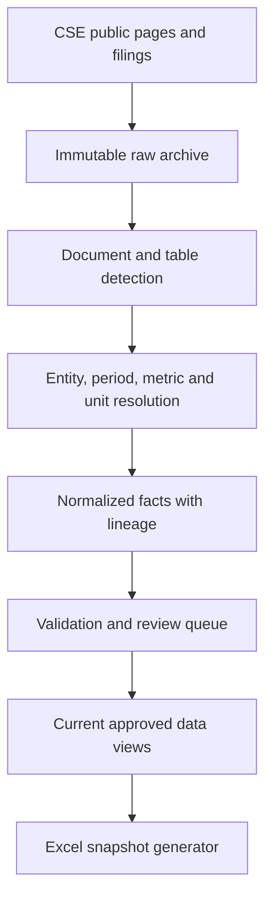

# CSE Quarterly Financial Data Platform

## Production specification and implementation blueprint

**Status:** Implemented and full-universe run completed; extracted exceptions remain review-controlled  
**Version:** 3.1  
**Design date:** 2026-09-04  
**Primary output:** Auditable Excel market-capitalization snapshot with a rolling three-period financial window  
**Operating model:** Local/on-premise Python ETL using public CSE information and issuer filings; no paid market-data account and no cloud AI dependency

---

## 1. Executive decision

This document replaces the two overlapping draft plans, freezes the architecture decisions, and records the contract implemented by the accompanying Python project.

The system is not a PDF scraper that writes directly into Excel. It is a small financial-data platform:



Excel is a generated report. It is never the master database and must not be manually used as the source for the next run.

### Frozen design decisions

- Financial facts are stored once at **issuer + period + entity-scope + filing-version** level.
- Market data and ranking are stored at **security-symbol + market-as-of-date** level.
- Flow metrics use the standalone three-month period. Stock metrics use the value as at the period end.
- Q4 flow metrics prefer an explicit standalone three-month/`4Q` column. When none exists, eligible flows may be derived only from compatible normalized cumulative and preceding standalone quarters with complete lineage; EPS is never derived this way.
- The nearest applicable explicit unit wins, with row/metric evidence taking precedence over broader declarations.
- Currency and scale are separate fields.
- Only absolute monetary metrics inherit a normal statement scale.
- Revised filings create new immutable versions; old versions are retained.
- ROE and ROA use same-quarter PAT divided by that quarter's closing equity or assets. NPM uses same-quarter PAT divided by that quarter's top line. No prior-period history is required.
- Snapshot sheets use a fixed rolling three-period window.
- The platform supports `GENERAL`, `BANK`, `FINANCE_COMPANY`, `INSURANCE`, and `OTHER_FINANCIAL` issuer types.

---

## 2. Scope

### In scope

- Discover the listed-security universe and issuer-to-security mappings.
- Capture a market snapshot: symbol, price, issued quantity, market capitalization and market-cap share.
- Discover, download, hash and version quarterly/interim financial statements.
- Extract standalone Company or Bank facts from digitally generated PDFs.
- Apply OCR only when a usable text layer is absent or demonstrably defective.
- Normalize units, periods, signs, metric names and entity scope.
- Validate facts and route uncertainty to a human review queue.
- Preserve full audit evidence for every accepted value.
- Produce a new Excel snapshot for each run while retaining prior snapshots.
- Backfill earlier periods without changing the meaning of already published snapshot dates.

### Not in scope for the first release

- Trading, portfolio management or investment recommendations.
- Real-time/intraday market data.
- A dashboard or public web application.
- Paid CSE data feeds.
- Silent use of consolidated data when standalone data is required.
- LLM-only extraction without deterministic evidence and validation.
- Fully automatic acceptance of low-confidence OCR results.

### Public-source policy

Use normal public web pages and public filing downloads. If the public CSE website itself calls an undocumented JSON endpoint, access to that endpoint is an implementation detail, not a guaranteed contract; keep it behind a source adapter and retain an HTML/browser fallback. Do not depend on a paid or authenticated market-data API.

---

## 3. Source and identity model

### 3.1 Issuer versus security

An issuer can have more than one listed security class. The supplied workbook contains 302 distinct symbols and 21 company names with multiple symbols. Therefore:

| Object | Natural/business key | Purpose |
|---|---|---|
| Issuer | `issuer_id` | Legal reporting entity |
| Security | `security_symbol` | Listed share/security class |
| Market snapshot | `(security_symbol, market_as_of_date)` | Price, issued quantity, market cap and rank |
| Financial period | `(issuer_id, period_end_date, period_type, entity_scope)` | Economic meaning of a financial record |
| Filing version | `filing_version_id` plus SHA-256 | Exact source version |
| Financial fact | Technical `fact_id` plus filing version | One metric with evidence and status |

Do not use company name as a join key. Names are descriptive attributes and may change.

### 3.2 Required master-data fields

**Issuer**

- `issuer_id`
- `legal_name`
- `issuer_type`
- `reporting_currency`
- `fiscal_year_end_month`
- `active_from`, `active_to`
- `standalone_scope_label` (`COMPANY`, `BANK`, or configured alternative)

**Security**

- `security_symbol`
- `issuer_id`
- `security_class`
- `voting_flag`
- `active_from`, `active_to`
- `source_security_id`, when publicly available

Master-data changes are effective-dated. Delisted/inactive securities retain historical facts and snapshots.

---

## 4. Filing and version model

Every downloaded document is immutable.

Required fields:

- `filing_id`
- `filing_version_id`
- `issuer_id`
- `period_start_date`
- `period_end_date`
- `period_type`
- `duration_months`
- `published_at`
- `discovered_at`
- `source_url`
- `source_filename`
- `local_archive_path`
- `sha256`
- `mime_type`
- `page_count`
- `text_layer_status`
- `supersedes_filing_version_id`
- `is_current_version`
- `review_status`

### Version rules

1. The same URL with the same hash is idempotent and is not reprocessed unless the extractor version changed.
2. The same business period with a different hash creates a new filing version.
3. A new version never deletes or overwrites the old version.
4. Only one approved current version is selected for reporting.
5. A restatement is visible in an audit comparison showing old value, new value and source versions.

---

## 5. Extraction pipeline

### 5.1 Run stages

1. `discover-securities`
2. `capture-market-snapshot`
3. `discover-filings`
4. `download-filings`
5. `classify-documents`
6. `extract-candidates`
7. `resolve-entity-period-unit`
8. `normalize-facts`
9. `validate`
10. `approve-or-quarantine`
11. `build-current-views`
12. `generate-workbook`
13. `publish-run-manifest`

Every stage is restartable and idempotent. A run receives a UUID, start/end timestamps, source date, code version, configuration hash and final status.

### 5.2 Text extraction strategy

Use a tiered approach:

1. Extract the native text layer with page coordinates.
2. Measure text quality: character count, numeric-token count, expected statement vocabulary and reading-order plausibility.
3. If quality fails, create an OCR derivative while preserving the original file.
4. Extract tables/rows from the best approved text representation.
5. Retain page number and bounding boxes when available.

Never OCR all documents by default; OCR can introduce digit, punctuation and negative-sign errors.

### 5.3 Candidate-first extraction

The parser may produce more than one candidate. It must not discard alternatives before context resolution.

Each candidate includes:

- raw label and normalized label candidate
- raw text and parsed numeric candidate
- row, column and table identifiers
- page and bounding box
- statement type
- entity-scope candidate
- period/date candidate
- unit candidates with scope and distance
- extraction method and confidence components

---

## 6. Entity-scope selection

### Allowed scope result

`COMPANY`, `BANK`, `CONSOLIDATED`, `GROUP`, `UNKNOWN`

### Rules

| Document structure | Selection |
|---|---|
| `Group | Company` columns | Select `Company` |
| `Group | Bank` columns | Select `Bank` |
| Separate Consolidated and Company statements | Select the Company statement |
| Standalone statement only | Accept after issuer and statement validation |
| Consolidated/Group only | `CONSOLIDATED_ONLY`; quarantine for review |
| Ambiguous column or statement | `ENTITY_SCOPE_AMBIGUOUS`; quarantine |

Scope must be resolved before a value is approved. Do not infer that the right-most column is Company or Bank without header evidence.

---

## 7. Period selection

### 7.1 Period types

- `QUARTER`: standalone three-month flow
- `YTD`: cumulative flow from fiscal-year start
- `FY`: full-year flow
- `AS_AT`: balance at a date

Store `period_start_date`, `period_end_date`, `duration_months`, `fiscal_year`, and `fiscal_quarter_label` separately. Dates, not labels such as “Q2 2026,” define the business key.

### 7.2 Metric behavior

**Flow metrics**

- Revenue / Gross income
- Operating profit
- PBT
- PAT
- EPS when explicitly reported for the standalone quarter

Use the standalone three-month column when published. Do not take a six- or nine-month cumulative value for a quarterly fact.

**Stock metrics**

- Total assets
- Total equity
- Total liabilities
- NAVPS
- Issued shares

Use the value as at the reporting date.

### 7.3 Q4 rule

Q4 flow metrics prefer an explicit standalone three-month/`4Q` column. When none exists, eligible flow metrics (`TOP_LINE`, `OPERATING_PROFIT`, `PBT`, `PAT`) may be derived only from compatible normalized cumulative values and preceding standalone quarters, with complete formula lineage. Do not publish a full-year column as Q4 without that derivation. Never derive Q4 EPS. If the inputs are missing or incompatible, record `EXACT_QUARTER_NOT_REPORTED` or `CUMULATIVE_ONLY`.

---

## 8. Unit detection engine

### 8.1 Precedence

The applicable explicit unit is chosen in this order:

1. Metric/row/cell-specific unit
2. Column-specific unit
3. Table-header unit
4. Statement unit
5. Page unit
6. Report default
7. Not found: review

Within the same scope, use geometric/text distance and table membership. If equally applicable evidence conflicts, do not guess; create `UNIT_CONFLICT`.

### 8.2 Unit components

Store separately:

- `currency`: `LKR`, `USD`, or another ISO 4217 code
- `scale_factor`: `1`, `1000`, `1000000`, `1000000000`
- `unit_source_text`
- `unit_scope`
- `unit_source_page`
- `unit_source_bbox`
- `unit_confidence`

### 8.3 Normalization dictionary

Matching is case-insensitive, whitespace-tolerant and punctuation-tolerant.

| Example source text | Currency | Scale |
|---|---:|---:|
| `Rs.`, `Rs`, `LKR`, `Sri Lanka Rupees` | LKR | 1 |
| `Rs.'000`, `Rs '000`, `Rs. 000`, `Rs.'000s`, `Rupees thousands`, `LKR '000` | LKR | 1,000 |
| `Rs. Mn`, `Rs Mn`, `LKR Mn`, `Rupees millions` | LKR | 1,000,000 |
| `Rs. Bn`, `LKR Bn`, `Rupees billions` | LKR | 1,000,000,000 |
| `USD`, `US$` | USD | 1 |
| `USD '000`, `US$ thousands` | USD | 1,000 |

The dictionary is configuration, not hard-coded company logic.

### 8.4 Metric-type system

| Metric type | Inherit ordinary statement monetary scale? | Examples |
|---|---|---|
| `MONETARY_ABSOLUTE` | Yes; unit required | Revenue, gross income, operating profit, PBT, PAT, equity, assets |
| `MONETARY_PER_SHARE` | No, unless explicitly local to the metric | EPS, NAVPS, DPS, share price |
| `COUNT` | No | Issued shares, employees, branches, shareholders |
| `PERCENTAGE` | No | ROE, ROA, NPM, public holding |
| `RATIO` | No | Debt/equity, capital ratios |
| `RANK` | No | Previous rank, current rank, rank change |

For an absolute monetary metric with no reliable unit, set `UNIT_NOT_DETECTED` and send it to review. Never silently default to scale 1.

### 8.5 Numeric parsing

- Parentheses mean negative unless the statement declares another convention.
- Preserve the raw text before parsing.
- Normalize commas, ordinary spaces and non-breaking spaces.
- Dash/blank is not zero; classify it as missing or not applicable from context.
- Preserve decimal precision with `Decimal`, not binary floating-point arithmetic.
- Do not convert a percentage label to a fraction until the metric definition specifies the stored representation.

---

## 9. Canonical metric catalog

### 9.1 Core output metrics

| Canonical metric | Type | Period behavior | General issuer mapping | Bank mapping |
|---|---|---|---|---|
| `TOP_LINE` | Monetary absolute | Flow | Revenue | Gross income |
| `OPERATING_PROFIT` | Monetary absolute | Flow | Operating profit / results from operating activities / EBIT, never EBITDA | Operating profit before taxes on financial services |
| `PBT` | Monetary absolute | Flow | Profit before tax | Profit before income tax |
| `PAT` | Monetary absolute | Flow | Profit for the period attributable to the standalone company | Profit for the period, Bank column |
| `EPS_BASIC` | Monetary per share | Flow | Basic EPS | Basic EPS, Bank column |
| `EPS_DILUTED` | Monetary per share | Flow | Diluted EPS | Diluted EPS, Bank column |
| `EPS_SELECTED` | Monetary per share | Flow | Diluted when reported, otherwise basic | Diluted when reported, otherwise basic |
| `NAVPS` | Monetary per share | As at | Net assets per share | Net asset value per ordinary share, Bank column |
| `TOTAL_EQUITY` | Monetary absolute | As at | Total equity, Company column | Total equity, Bank column |
| `TOTAL_ASSETS` | Monetary absolute | As at | Total assets, Company column | Total assets, Bank column |
| `TOTAL_LIABILITIES` | Monetary absolute | As at | Explicit total, or Assets minus Equity with derived lineage | Explicit total, or Assets minus Equity with derived lineage |
| `MARKET_PRICE_QUARTER_END` | Monetary per share | As at | Exact security class, filing price first | Exact security class, filing price first |

`TOP_LINE` retains `source_metric_code` so users can distinguish `REVENUE` from `GROSS_INCOME`.

### 9.2 Finance companies and insurance

Do not force them through general-company aliases.

- `FINANCE_COMPANY`: configure top-line and operating-profit aliases from the approved reporting format; retain the exact source definition.
- `INSURANCE`: prefer IFRS 17 insurance revenue for top line. Accept operating profit only when explicitly presented or when a formally approved mapping exists.
- `OTHER_FINANCIAL`: issuer-specific mapping requires documented approval.

Unknown mappings become `METRIC_MAPPING_REQUIRED`, not a guessed value.

---

## 10. Financial fact data contract

One row represents one metric from one filing version.

```text
fact_id
issuer_id
security_symbol                 nullable; facts are normally issuer-level
metric_code
source_metric_code
metric_type
entity_scope
period_start_date
period_end_date
period_type
duration_months
raw_label
raw_text
raw_value_decimal
currency
scale_factor
normalized_value_decimal
unit_source_text
unit_source_page
unit_scope
unit_confidence
source_page
source_bbox
filing_version_id
source_file_sha256
extraction_method
extractor_version
extraction_confidence
derived_flag
derived_method
validation_status
missing_reason
review_status
created_at
```

Use `DECIMAL(38, 6)` or an equivalent decimal representation for monetary and per-share values. Never store approved monetary facts as float.

---

## 11. Ratio definitions

Ratios are derived facts with lineage to their inputs. Each ratio uses only the same quarter's approved standalone facts. No prior-period history is required.

### 11.1 ROE

```text
PAT / Total equity
```

Use the approved standalone PAT and closing equity for that period end.

### 11.2 ROA

```text
PAT / Total assets
```

Use the approved standalone PAT and closing total assets for that period end.

### 11.3 NPM

```text
PAT / TOP_LINE
```

For banks, label this as `PAT / Gross income` in the metric definition. It is an analytical margin, not a substitute for bank-specific profitability or efficiency ratios.

### 11.4 Ratio status

No ratio is produced unless every required input is approved and compatible. Use:

- `MISSING_DENOMINATOR`
- `NON_POSITIVE_DENOMINATOR`
- `INCOMPATIBLE_SCOPE`
- `INCOMPATIBLE_CURRENCY`
- `ZERO_EQUITY`

Do not label a same-quarter ratio as TTM.

---

## 12. Validation engine

### 12.1 Blocking checks

- Filing hash and version resolved.
- Issuer and entity scope resolved.
- Period end and period type resolved.
- Absolute monetary metric has currency and unit evidence.
- No duplicate approved fact for the same filing version and metric context.
- Correct standalone Company/Bank scope.
- Flow metric uses the correct duration.
- Stock metric uses the reporting date.
- Q4 flow metric is an explicit standalone three-month value.
- Value parses without dropped sign or decimal separator.
- Normalized value equals raw value multiplied by approved scale.

### 12.2 Financial checks

- `Total assets = Total equity + Total liabilities` within configured tolerance when all terms are available.
- PAT is consistent with PBT and tax presentation where the statement supports the check.
- NAVPS is directionally reconcilable to equity and share count where compatible share data is available.
- EPS is directionally reconcilable to PAT and weighted-average shares when available.
- Market capitalization equals price multiplied by issued quantity within tolerance.
- Market-cap shares sum to approximately 100% across priced securities.
- Extreme quarter-over-quarter movements trigger review, not automatic rejection.

### 12.3 Confidence policy

Confidence is a structured score composed of:

- statement detection
- entity scope
- period/column selection
- label mapping
- unit evidence
- numeric parsing
- reconciliation checks

Suggested action thresholds:

- `>= 0.95` and all blocking checks pass: auto-approve
- `0.80–0.9499`: manual review
- `< 0.80`: quarantine

Thresholds are configuration and must be calibrated against a labeled validation set.

---

## 13. Missing data and review workflow

Do not use a generic blank as the only state.

Allowed missing/review reasons:

- `NOT_REPORTED`
- `NOT_APPLICABLE`
- `PENDING_FILING`
- `NO_PRICE`
- `CONSOLIDATED_ONLY`
- `EXTRACTION_FAILED`
- `UNIT_NOT_DETECTED`
- `UNIT_CONFLICT`
- `ENTITY_SCOPE_AMBIGUOUS`
- `PERIOD_AMBIGUOUS`
- `METRIC_MAPPING_REQUIRED`
- `EXACT_QUARTER_NOT_REPORTED`
- `HISTORICAL_PRICE_NOT_AVAILABLE`
- `BALANCE_SHEET_RECONCILIATION_FAILED`
- `ZERO_EQUITY`
- `INSUFFICIENT_HISTORY`

A reviewer can accept, correct or reject a candidate. The decision records reviewer, timestamp, reason, old value and new value. Corrections create a new curated fact; raw extracted evidence remains unchanged.

---

## 14. Storage design

### Recommended local architecture

| Layer | Format | Purpose |
|---|---|---|
| Raw | Original PDF/HTML/JSON bytes | Immutable evidence |
| Bronze | Coordinate-preserving document IR/cache | Source-oriented extraction records |
| Silver | Partitioned Parquet + JSONL | Versioned facts, prices, filings and immutable evidence |
| Gold | Parquet current views | Current facts/prices, coverage and accuracy/certainty scorecards |
| Review/curated | Parquet | Typed review queue and separately approved corrections |
| Staging | Per-run Parquet/JSONL | Atomic write-before-promotion boundary |
| Outputs | CSV plus generated XLSX/JSON | Snapshot-ready tables, review exports and manifests |
| Quarantine | Original recoverable files | Failed/corrupt artifacts retained for investigation |

Partition fact data by `period_end_year` and optionally issuer. Do not create thousands of tiny files; compact partitions after successful runs.

The first release is intentionally database-free. Polars writes compressed Parquet partitions and JSONL evidence, then atomically promotes a successful run to gold current views. A technical run/source hash preserves revisions. Add a database only if concurrent writers or a transactional review application becomes a real requirement.

### Backup

- Back up raw evidence, silver partitions, gold current views, generated CSVs/workbooks and run manifests together.
- Use daily incremental and monthly immutable backups according to departmental retention policy.
- Verify restore procedures at least quarterly.

---

## 15. Excel output contract

### 15.1 Workbook sheets

1. `README`
2. One `Snapshot_YYYY-MM-DD` sheet per market snapshot
3. `Checks`
4. `Accuracy_Certainty`
5. `Audit_Lineage`
6. `Price_Lineage`
7. `Review_Queue`
8. `Metric_Definitions`

### 15.2 Snapshot grain

One row per `security_symbol` for a single `market_as_of_date`.

Financial facts are joined from issuer to every active security class of that issuer. This is intentional; it does not duplicate the stored issuer-level fact.

### 15.3 Base columns

- Previous rank
- Current rank
- Rank change
- Company name
- Symbol
- Price (LKR)
- Issued quantity
- Market capitalization (LKR)
- Market-cap share
- Market-data status

### 15.4 Rolling financial window

Each snapshot contains exactly three period blocks. Each block contains:

- PAT
- PBT
- EPS selected (diluted preferred; basic fallback)
- NAVPS
- Operating profit
- Total equity
- Total assets
- Total liabilities
- Revenue / Gross income
- Market price at quarter end
- Debt to equity (multiple)
- ROE
- ROA
- NPM

The period dates are real dates and are not embedded as incorrect text copied between sheets.

Example:

| Market snapshot | Financial period blocks |
|---|---|
| 2026-09-02 | 2025-12-31, 2026-03-31, 2026-06-30 |
| 2026-12-31 | 2026-03-31, 2026-06-30, 2026-09-30 |

### 15.5 Ranking

- Current rank is calculated from market capitalization among securities with a valid market cap.
- Previous rank is joined by `security_symbol` from the immediately preceding market snapshot.
- `rank_change = previous_rank - current_rank`, so a positive value means the security moved up.
- A symbol with no previous snapshot match is `NEW`.
- No-price securities remain in the sheet with `NO_PRICE` and an unassigned market-cap rank.

### 15.6 Formatting

- LKR absolute amounts: `#,##0;[Red](#,##0);-`
- Per-share values: `0.00;[Red](0.00);-`
- Percentages: `0.00%`
- Counts and ranks: `#,##0`
- Dates: `yyyy-mm-dd`
- Freeze identifier columns and the header rows.
- Hide default gridlines and use restrained section formatting.
- No placeholder text such as `PAT/EQ`, `PT/TA` or `PAT/TR` may appear in numeric cells.

---

## 16. Technology stack

### 16.1 Recommended baseline

| Concern | Choice | Why |
|---|---|---|
| Language | Python 3.12 baseline; test 3.13 | Mature PDF/data ecosystem and conservative enterprise compatibility |
| Project/dependency management | `uv`, `pyproject.toml`, committed `uv.lock` | Reproducible environments and fast local setup |
| HTTP | Python standard library | No additional dependency; bounded retries and timeouts |
| Browser fallback | Playwright, optional | JS-rendered public pages only when HTTP/HTML is insufficient |
| PDF text | PyMuPDF word coordinates + measured pdfplumber fallback | Fast coordinate IR with an independent fallback for sparse/broken reading order |
| OCR fallback | OCRmyPDF + Tesseract, optional system dependency | Searchable OCR derivative without sending filings to an external service |
| Document understanding | Visual-row reconstruction, numeric-column clustering, RapidFuzz; optional MiniLM | Resolves labels and column geometry without an external AI service |
| Dataframes/file store | Polars + PyArrow + Parquet/JSONL | Database-free, typed, compressed and locally queryable persistence |
| Validation | Dataclasses, Pydantic contracts, Decimal rules and deterministic checks | Typed evidence, exact arithmetic and fail-closed statuses |
| Operational store | Atomic Parquet/JSONL staging and current views | Restartable local runs with versioned source hashes |
| Excel generation | openpyxl | New workbooks, formulas, styles, comments and validation sheets |
| CLI | Typer | Clear operator commands and help |
| Logging | structlog or standard JSON logging | Machine-readable run and audit logs |
| Testing | pytest + Hypothesis + golden-file fixtures | Unit, property and document-regression coverage |
| Quality | Ruff + mypy + pre-commit | Fast linting, formatting and static checks |
| Scheduling | Windows Task Scheduler or cron | Adequate for one-machine quarterly/daily jobs |
| Packaging | Optional Docker image plus offline wheel bundle | Reproducible deployment while supporting restricted networks |
| CI | Internal GitLab/Jenkins or GitHub Actions if permitted | Automated tests and artifact build |

Do not add Airflow, Spark, Kafka, Kubernetes or a cloud warehouse in the first release. They solve scale and concurrency problems this dataset does not have.

### 16.2 Upgrade triggers

- Add Prefect/Dagster only when orchestration, retries and monitoring span several workers or machines.
- Move to PostgreSQL when multiple users write concurrently or a review UI needs transactions.
- Add object storage when the raw archive exceeds local retention/backup limits.
- Add an internal review web app only after the spreadsheet/review queue workflow is proven insufficient.

### 16.3 Current reference documentation

- Python: <https://docs.python.org/3/>
- uv: <https://docs.astral.sh/uv/>
- Apache Parquet: <https://parquet.apache.org/docs/>
- Polars: <https://docs.pola.rs/>
- PyMuPDF: <https://pymupdf.readthedocs.io/>
- pdfplumber: <https://github.com/jsvine/pdfplumber>
- Pydantic: <https://docs.pydantic.dev/latest/concepts/models/>
- Playwright for Python: <https://playwright.dev/python/docs/intro>
- OCRmyPDF: <https://ocrmypdf.readthedocs.io/>
- openpyxl: <https://openpyxl.readthedocs.io/>

---

## 17. Repository structure

```text
cse-financial-data-platform/
├── .vscode/
│   ├── launch.json
│   └── tasks.json
├── README.md
├── pyproject.toml
├── uv.lock
├── .python-version
├── .env.example
├── .gitignore
├── Makefile
├── Dockerfile                       # optional deployment path
├── configs/
│   ├── app.yml
│   ├── issuers.yml
│   ├── metric_catalog.yml
│   ├── unit_patterns.yml
│   └── validation_rules.yml
├── data/                            # generated and ignored
│   ├── raw/
│   │   ├── api/
│   │   └── filings/
│   ├── bronze/
│   ├── staging/<run-id>/
│   ├── silver/
│   │   ├── financial_facts/year=YYYY/
│   │   ├── market_prices/year=YYYY/
│   │   └── evidence/year=YYYY/
│   ├── gold/
│   │   ├── current_financial_facts.parquet
│   │   ├── current_market_prices.parquet
│   │   └── accuracy_certainty.parquet
│   ├── review/review_queue.parquet
│   ├── curated/manual_corrections.parquet
│   └── quarantine/
├── docs/
│   ├── architecture.md
│   ├── data_contract.md
│   ├── metric_methodology.md
│   ├── operator_runbook.md
│   ├── production_specification.md
│   └── review_guide.md
├── src/cse_financial_etl/
│   ├── __init__.py
│   ├── __main__.py
│   ├── cli.py
│   ├── domain/
│   │   ├── enums.py
│   │   └── models.py
│   ├── sources/cse.py
│   ├── documents/pdf_text.py
│   ├── extraction/
│   │   ├── statement_extractor.py
│   │   └── unit_detector.py
│   ├── transformation/normalizer.py
│   ├── validation/
│   ├── storage/repository.py
│   ├── reporting/excel.py
│   └── orchestration/pipeline.py
├── tests/unit/
├── scripts/
│   ├── bootstrap.ps1
│   └── bootstrap.sh
└── outputs/                         # generated workbook, CSV and JSON artifacts
```

The source package is organized by responsibility, not by one file per company. Issuer-specific exceptions belong in configuration or narrow adapters with tests.

---

## 18. Configuration contracts

### Metric catalog

Each metric definition contains:

- canonical code and display label
- metric type
- period behavior
- aliases by issuer type
- prohibited aliases (for example EBITDA for operating profit)
- allowed entity scopes
- explicit-quarter requirement for Q4
- sign expectations
- Excel format

### Unit patterns

Each unit pattern contains:

- regular expression
- currency
- scale factor
- normalized source-unit label
- priority/specificity

### Issuer overrides

Overrides must include a reason, effective date and test fixture. They may resolve persistent issuer-specific layout or terminology, but must never hard-code a value.

---

## 19. Operator commands

Target CLI:

```bash
uv sync --all-extras
uv run cse-etl discover-securities
uv run cse-etl detect-unit "Rs.'000" --value 16621006
uv run cse-etl run --project-root .
uv run cse-etl run --issuer-limit 4 --project-root .
uv run cse-etl run --as-of 2026-09-04 --periods 2025-12-31,2026-03-31,2026-06-30 --project-root .
```

The report command fails closed if blocking checks fail, unless an authorized operator explicitly generates a draft workbook marked `DRAFT - UNAPPROVED`.

---

## 20. Security and operations

- Respect CSE terms, robots directives and reasonable request rates.
- Use an identifiable internal user agent and bounded retry/backoff.
- Validate MIME type, file signature, page count and maximum file size before processing.
- Disable PDF JavaScript and never execute embedded content.
- Store source files in a non-executable archive location.
- Do not log credentials, cookies, personal data or full local paths unnecessarily.
- Pin dependencies in `uv.lock`; scan dependencies and container images according to departmental policy.
- Maintain role separation between automated extraction, review and final approval where operationally required.
- Record configuration and code hashes in each run manifest.

---

## 21. Testing strategy

### Unit tests

- Unit-text variants and precedence
- Numeric parsing, negatives, blanks and decimals
- Metric aliases and prohibited aliases
- Entity-scope resolution
- Period and standalone-quarter selection
- Explicit standalone Q4 selection and annual-only rejection
- Ratio completeness and denominator rules
- Rank joins by symbol

### Golden-document tests

Maintain licensed/approved fixtures representing:

- JAT: full LKR units, Group/Company columns
- Dialog: LKR thousands, quarter and cumulative columns, Group/Company
- Commercial Bank: LKR thousands, Group/Bank and bank-specific labels
- JKH: separate consolidated and company statements
- scanned filing requiring OCR
- revised filing with the same business period
- finance company and insurer
- consolidated-only filing

Expected results include values, source pages, entity scope, periods, unit evidence and review status.

### Regression acceptance

A parser change cannot be released if it changes an approved golden fact without an explicitly reviewed fixture update.

---

## 22. Implementation phases

### Phase 0 - Governance and source confirmation

- Confirm public-source access method and rate limits.
- Approve metric definitions for finance companies and insurers.
- Approve retention, review and sign-off responsibilities.

### Phase 1 - Foundation

- Repository, configuration, domain models, Parquet/JSONL schemas and run manifests.
- Security/issuer master data import.
- Market snapshot and ranking pipeline.

### Phase 2 - Four-parser vertical slice

- Implement and pass the four supplied golden filings.
- Deliver the unit engine, entity scope, period selection and long-form facts.
- Generate the corrected workbook from approved facts.

### Phase 3 - Coverage

- Expand to the full issuer universe.
- Add finance-company and insurance mappings.
- Add OCR and table fallbacks.
- Build reviewer export/import workflow.

### Phase 4 - Backfill and hardening

- Historical backfill.
- Performance, idempotency, backups and recovery tests.
- Operational runbook and user acceptance testing.

### Phase 5 - Production

- Scheduled runs.
- Exception monitoring.
- Monthly accuracy sampling and quarterly disaster-recovery test.

---

## 23. Acceptance criteria

The first production release is accepted only when:

- 100% of securities have stable issuer mappings or an explicit unresolved status.
- Duplicate `(security_symbol, market_as_of_date)` records are rejected.
- All absolute monetary facts have traceable currency and scale evidence.
- No Group/Consolidated value is published as Company/Bank without an approved exception.
- All Q1-Q3 flow facts use standalone-quarter values.
- No Q4 fact is published from an FY column or FY-minus-9M calculation.
- Revised filings retain prior versions.
- Market capitalization reconciles to price × issued quantity within tolerance.
- The workbook contains no formula errors, wrong year labels, misspelled metric headers or placeholder formulas.
- Every published fact can be traced to filename/hash, page, statement, raw label, raw value, unit evidence and extraction method.
- The four supplied filings pass golden regression tests.
- Backup and restore are demonstrated.

---

## 24. Verified sample behavior

The supplied documents prove these required paths:

| Sample | Correct scope | Unit behavior | Period behavior |
|---|---|---|---|
| JAT Holdings | Company | `Rs.` ×1 | Three months ended 2026-06-30; balance at 2026-06-30 |
| Dialog Axiata | Company | Sri Lanka Rupees thousands ×1,000; per-share rows unscaled | Standalone quarter column, not six months |
| Commercial Bank | Bank | `Rs.'000` ×1,000; EPS/NAVPS unscaled | Bank quarter and Bank balance-sheet columns |
| John Keells Holdings | Separate Company statements | `Rs '000s` ×1,000; per-share row unscaled | Company income statement and Company financial position |

These examples are regression fixtures, not special company code.

---

## 25. Final outcome

This specification resolves the defects in the earlier drafts:

- unit ambiguity and incorrect per-share scaling
- flow-versus-stock period confusion
- annual/cumulative Q4 substitution
- Company/Bank versus Group selection
- security-versus-issuer identity
- revisions and immutable filing versions
- missing PBT output
- wrong workbook dates and spelling
- row-position rank logic
- placeholder ratio formulas
- ambiguous ROE/ROA definitions
- weak missing-data and audit states
- unnecessary warehouse/orchestrator infrastructure

Implementation can now begin against a stable contract. Any future architecture change should be made through a documented decision record and a corresponding test/configuration change.
